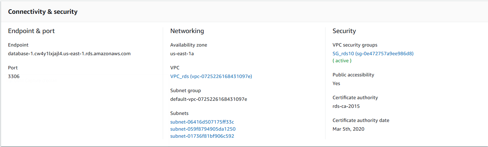
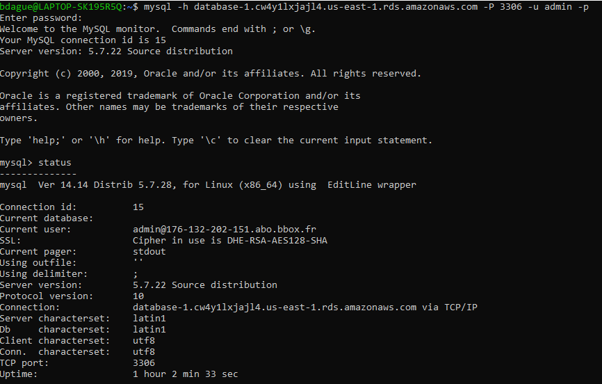

# AWS RDS setup and access
 Tutorial

 ## Database not publicly accessible
 ###Architecture
 **VPC**
 * IGW
 * Subnet1 Private in AZ1
 * Subnet2 Private in AZ2 (different from AZ1)
 * Subnet3 Public
 ** Route table: RT-table -> add 0.0.0.0/0 to IGW

 **RDS instance**
 See create database instance below

 **EC2 Instance**
 * belongs to Subnet3
 * Public IP

 SG1:

 allow Inbound SSH from local
 allow Outbound All traffic
 Create Database (not publicly accessible)
 Create database (example MariaDB)

# Create Database (not publicly accessible)
* Create database (example mysql)

## Setting
* Choose the service RDS from AWS,
* Choose Standard create,
* Choose MySQL as engine type,
* Give a name to your DB instance: Database_1
* Give a Master username: admin
* Give your password :*********
* Confirm your password: *********

## Creation method and engine option

## Template

* Choose the free tier template available for 12 months.

## Connectivity

* Don't choose the VPC security group by default.

## Security Group description

By Default Security group is created only for your current IP (Source). To be able to connect, it needs to be changed:

## Additional configurations

* Do not enable automatic backups

## Screen during Database Creation

## Connection information

# Connect to the data base called Database_1

## Connect to the database using Linux:

## Connect to the database using MYSQL:

## Connect to the database via using Python)

The installation of the package called pymysql is needed.

Herebelow the script Python to connect to the database.

Herebelow the result of the request on Python. A list of the different database.

The table called student is found by the following commands:

# Create Database (publicly accessible)

* The DNS resolution and DSN hosnames should be set at enable.
* When creating the RDS instance, this last one is set as Publicly accessible. 

### Useful commands:

* SHOW TABLES;
* DESCRIBE table;
* DROP TABLE table;
* Create table (SQL):

**Architecture**

# VPC
* Subnet1 in AZ1
* Subnet2 in AZ2 (different from AZ1)

# RDS instance
* Enable DNS resolution and DNS hostnames for your VPC
